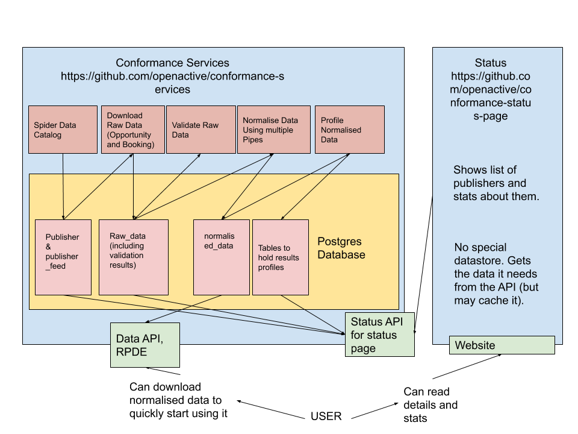

# Architecture

This describes the Architecture across 2 repositories, the interactions between them and the interactions a user would do.

The repositories are:

* https://github.com/openactive/conformance-services (This repository, the blue box on the left)
* https://github.com/openactive/conformance-status-page (the blue box on the right)

It shows the flow of data working through the system by showing each stage, 
the database used by conformance-services and a rough guide to which tables are used at which stages.

The stages can be thought of as running in a set order:

* Spider Data Catalog - discover all publisher and feed end points. [More info](stage/spider-data-catalog.md).
* Download Raw Data - download data and store. [More info](stage/download-raw-data.md).
* Validate Raw Data - validate and store results.  [More info](stage/validate-raw-data.md).
* Normalise Data using multiple pipes - normalise and store results.  [More info](stage/normalise-data.md).
* Profile Normalised Data - profile and store results.  [More info](stage/profile-normalised-data.md).

The status webpage then gets the data it needs from an HTTP API on the Conformance Services app. [More info](http-apis.md).

The actual user will start by browsing the status page and seeing information on that; 
but if they want more detailed information they may end up getting this directly from the Conformance Services app. [More info](http-apis.md).
