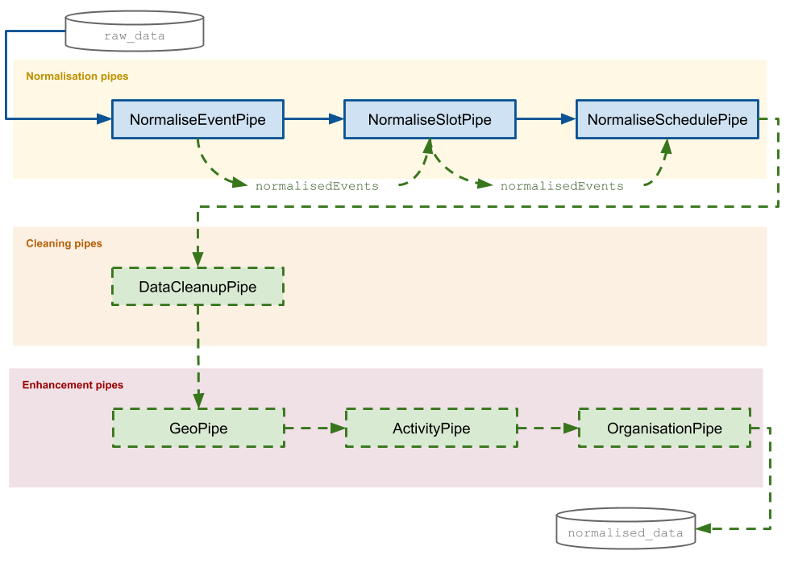

# Normalisation Overview

The 'pipeline' consists of several 'pipes' which are run in turn.

Each object from the `raw_data` table is passed into each pipe.
The pipeline is initialised with an empty array called `normalisedEvents`.

Each pipe has access to the `normalisedEvents` array, and if the pipe is able to generate a normalised event from the input data, the normalised event is added to this array. Pipes may also edit or remove data from this array, and it is passed from pipe to pipe. In the diagram below, pipes which generate normalised events from the raw data are indicated with a solid (blue) border and pipes which manipuplate data from the `normalisedEvents` array have a dashed (green) border.

When all pipes are run, the objects in the `normalisedEvents` are stored in the `normalised_data` table.

## Configuring the pipeline

The order of the pipes can be configured in `src/lib/pipes/index.js`. They are run in the order in this file, from top to bottom, so to change the order simply move a pipe up or down the list.

Similarly, to disable a pipe, you can comment it out in this list.

When adding new pipes, don't forget to import them from their respective files.

## Types of pipes

There are three kinds of pipes:

* [Normalisation pipes](normalisation-pipes.md)
* Cleaning pipes
* Enhancement pipes